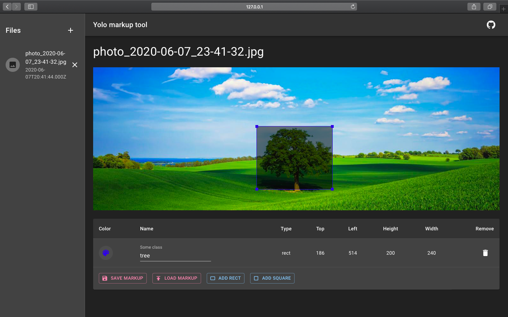

# yolo-mark-pwa

> PWA for marking bounded boxes of objects in images for training neural network Yolo v3 and v2 with touchscreen support right in your web browser

## DEPRECATED

Source code moved to the [new GitHub repo](https://github.com/tripolskypetr/material-ui-umd/tree/master/packages/yolo-mark-pwa)

## Browser support, development reason

Wrote for *Desktop Chrome 83*, but it look's like works in *Desktop Firefox 77* too. *Desktop Safari 12.1.1 on Mac OS 10.14.5* works like a charm. It wood be great to test on iPad mobile safari.
